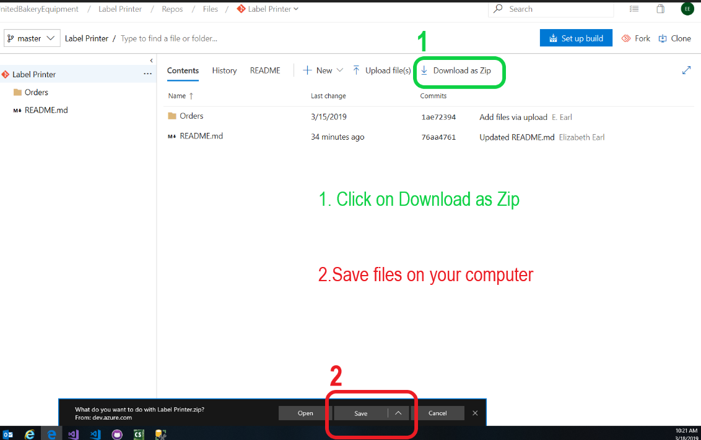
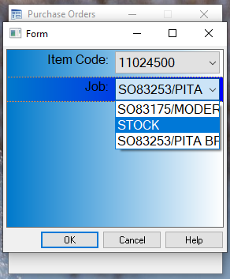

# LabelPrinter
Print Sales|Purchase|Work orders with up-to-date information such as ItemCode, Part Number, Description, etc. Built using Teklynx's Label Designer CODESOFT; program works hand in hand with Company's database files to produce relevant labels based on provided information.


## Table of contents
* [Features](#features)
* [Getting Started](#getting-started)
  * [Prerequisites](#prerequisites)
  * [Installing](#installing)
  * [Running](#running)
    * [Sales](#sales)
    * [Purchasing](#purchasing)
    * [Work](#work)
* [Built With](#built-with)
* [Troubleshooting](#troubleshooting)
* [Authors](#authors)
* [Copyright and License](#copyright-and-license)


## Features
Few things you can do using CODESOFT's Label Printer:
* View Purchase|Sales|Work order label previews based on Order Number and other required parameters
* Print individual labels per item in a given Purchase|Sales|Work order
  * *Quantity of labels printed for Purchase|Sales order items is dependent on quantity of each item in the order*
  * *Quantity of labels printed for Work order items is set to default **1***
* View item values that make up an order


## Getting Started

### Prerequisites
* CODESOFT [[Demo]](https://www.teklynx.com/en/products/request-demo?product=CODESOFT)


### Installing 
### **Open [Label Printer](https://dev.azure.com/UnitedBakeryEquipment/_git/Label%20Printer)<br />**



### Running

#### Sales
*\*Refer to [Installing](#installing) prior to running program\**
1. Once program files are downloaded, double-click and run **sales.Xmf** file <br />
	<br />
2. On the interactive window locate and click the box to the right of **"Order Number:"**<br />
	<br />
  *\*A user may also choose to manually input the Sales Order No.* <br />
3. Locate and click the button to the right of **"ItemCode:"**<br />
	   <br />
 *\*Select an Item Code*<br />
 *\**Once Item Code is selected click **"OK"** to return to the previous window*<br />
4. Click **"Print"** once content with the values in the preview pane to print the provided label <br />
5. Complete steps 3-4 for each additonal item you wish to print from an order <br />
	*\*Follow from steps 2-4 to change the Sales Order No. you are working on* <br />
6. To close the program simply click the **"X"** on the top right corner of the dialog box<br />


#### Purchasing
*\*Refer to [Installing](#installing) prior to running program\**
1. Once program files are downloaded, double-click and run **purchase.Xmf** file <br />
	<br />
2. On the interactive window locate and click the box to the right of **"Order Number:"**<br />
	<br />
  *\*A user may also choose to manually input the Purchase Order No.*<br />
3. Locate and click the button to the right of **"ItemCode | Job:"**<br />
	<br />
   *\*Select an Item Code and Job*<br />
 *\**Once the Item Code AND Job are selected click **"OK"** to return to the previous window*<br />
4. Click **"Print"** once you are are content with the values in the preview pane to print the provided label <br />
5. Complete steps 3-4 for each additonal Item/Job you wish to print from an order <br />
	*\*Follow from steps 2-4 to change the Purchase Order No. you are working on* <br />
6. To close the program simply click the **"X"** on the top right corner of the dialog box<br />


#### Work
*\*Refer to [Installing](#installing) prior to running program\**
1. Once program files are downloaded, double-click and run **workOrders.Xmf** file <br />
	<br />
2. On the interactive window locate and click the box to the right of **"Work Order:"**<br />
	<br />
  *\*A user may also choose to manually input the Work Order No.*<br />
3. Locate and click the button to the right of **"ItemCode | PartNumber:"** <br />
	<br />
   *\*Select an Item Code and Part No.*<br />
 *\**Once the Item Code AND Part No are selected click **"OK"** to return to the previous window*<br />
4. Click **"Print"** once you are are content with the values in the preview pane to print the provided label <br />
5. Complete steps 3-4 for each additonal Item/PartNumber you wish to print from an order <br />
	*\*Follow from steps 2-4 to change the Work Order No. you are working on* <br />
6. To close the program simply click the **"X"** on the top right corner of the dialog box<br />


## Built With
* Label Designer - [CODESOFT](https://www.teklynx.com/en/products/label-design-solutions/codesoft)
#### For usage on
* [Brady IP300 Printer](https://www.bradyid.com/retired-printers/IP-printer?Ntt=ip%20printer)


## Troubleshooting
*\*In the event an error arises ensure the following parameters are met*
* Open the **Purchase**|**SalesOrders**|**WorkOrder** **.lab** file on CODESOFT corresponding to the Order type you are working on 
* Ensure all sub-Tables in **Purchase**|**SalesOrders**|**WorkOrder** **.lab** \***Table lookup**\* point to **dat8121** under **Selet a data source**
* Ensure **Table lookup** and **When printed** have the same value in the paranthesis
	* (6) for **SalesOrders.lab** & **Purchase.lab** and (7) for **WorkOrder.lab** <br />
* See [SQL queries](#queries) to ensure all values have the correct query input under **Table lookup** **SQL \[SQL Query Builder\]**


### Queries
* [Sales Order](#sales-query) Query
* [Purchase](#purchase-query) Query
* [Work Order](#work-query) Query

#### Sales Query
* DescTable:
	```
	SELECT [lbl_SalesOrder].[Description] FROM [lbl_SalesOrder] WHERE 
	[lbl_SalesOrder].[ItemCode] = APPLICATION.DOCUMENT.[ItemPrint] AND 
	[lbl_SalesOrder].[RefNumber] = APPLICATION.DOCUMENT.[RefNoPrint]
	```
* ItemTable
	```
	SELECT DISTINCT [lbl_SalesOrder].[ItemCode] FROM [lbl_SalesOrder] WHERE 
	[lbl_SalesOrder].[RefNumber] = APPLICATION.DOCUMENT.[RefNoPrint] 
	ORDER BY ItemCode
	```
* JobTable
	```
	SELECT [lbl_SalesOrder].[PONumber] FROM [lbl_SalesOrder] WHERE 
	[lbl_SalesOrder].[ItemCode] = APPLICATION.DOCUMENT.[ItemPrint] AND 
	[lbl_SalesOrder].[RefNumber] = APPLICATION.DOCUMENT.[RefNoPrint]
	```
* PartNoTable
	```
	SELECT [lbl_SalesOrder].[PartNumber] FROM [lbl_SalesOrder] WHERE 
	[lbl_SalesOrder].[ItemCode] = APPLICATION.DOCUMENT.[ItemPrint] AND 
	[lbl_SalesOrder].[RefNumber] = APPLICATION.DOCUMENT.[RefNoPrint]
	```
* QuantityTable
	```
	SELECT [lbl_SalesOrder].[Quantity] FROM [lbl_SalesOrder] WHERE 
	[lbl_SalesOrder].[PartNumber] = APPLICATION.DOCUMENT.[PartNoPrint] AND 
	[lbl_SalesOrder].[ItemCode] = APPLICATION.DOCUMENT.[ItemPrint] AND 
	[lbl_SalesOrder].[RefNumber] = APPLICATION.DOCUMENT.[RefNoPrint]
	```
* RefTable
	```
	SELECT DISTINCT [RefNumber] FROM [lbl_SalesOrder] 
	ORDER BY RefNumber DESC
	```
	
#### Purchase Query 
* DescTable
	```
	SELECT [lbl_PurchaseOrder].[Description] FROM [lbl_PurchaseOrder] WHERE 
	[lbl_PurchaseOrder].[PartNumber] = APPLICATION.DOCUMENT.[PartPrint] AND 
	[lbl_PurchaseOrder].[ItemCode] = APPLICATION.DOCUMENT.[ItemPrint] AND 
	[lbl_PurchaseOrder].[RefNumber] = APPLICATION.DOCUMENT.[RefPrint]
	```
* ItemTable
	```
	SELECT DISTINCT [lbl_PurchaseOrder].[ItemCode] FROM [lbl_PurchaseOrder] WHERE 
	[lbl_PurchaseOrder].[RefNumber] = APPLICATION.DOCUMENT.[RefPrint] 
	ORDER BY ItemCode DESC
	```
* JobTable
	```
	SELECT [lbl_PurchaseOrder].[Job] FROM [lbl_PurchaseOrder] WHERE 
	[lbl_PurchaseOrder].[PartNumber] = APPLICATION.DOCUMENT.[PartPrint] AND 
	[lbl_PurchaseOrder].[ItemCode] = APPLICATION.DOCUMENT.[ItemPrint] AND 
	[lbl_PurchaseOrder].[RefNumber] = APPLICATION.DOCUMENT.[RefPrint]
	```
* PartTable
	```
	SELECT [lbl_PurchaseOrder].[PartNumber] FROM [lbl_PurchaseOrder] WHERE 
	[lbl_PurchaseOrder].[ItemCode] = APPLICATION.DOCUMENT.[ItemPrint] AND 
	[lbl_PurchaseOrder].[RefNumber] = APPLICATION.DOCUMENT.[RefPrint]
	```
* QuantityTable
	```
	SELECT [lbl_PurchaseOrder].[Quantity] FROM [lbl_PurchaseOrder] WHERE 
	[lbl_PurchaseOrder].[Job] = APPLICATION.DOCUMENT.[JobPrint] AND 
	[lbl_PurchaseOrder].[ItemCode] = APPLICATION.DOCUMENT.[ItemPrint] AND 
	[lbl_PurchaseOrder].[RefNumber] = APPLICATION.DOCUMENT.[RefPrint]
	```
* RefTable
	```
	SELECT DISTINCT [RefNumber] FROM [lbl_PurchaseOrder] 
	ORDER BY RefNumber DESC
	```

#### Work Query
* DescTable
	```
	SELECT [lbl_WorkOrder].[Description] FROM [lbl_WorkOrder] WHERE 
	[lbl_WorkOrder].[PartNum] = APPLICATION.DOCUMENT.[PartPrint] AND 
	[lbl_WorkOrder].[ItemCode] = APPLICATION.DOCUMENT.[ItemPrint] AND 
	[lbl_WorkOrder].[WorkOrder] = APPLICATION.DOCUMENT.[WorkOrderPrint]
	```
* ItemTable
	```
	SELECT DISTINCT [lbl_WorkOrder].[ItemCode] FROM [lbl_WorkOrder] WHERE 
	[lbl_WorkOrder].[WorkOrder] = APPLICATION.DOCUMENT.[WorkOrderPrint] 
	ORDER BY ItemCode
	```
* JobTable
	```
	SELECT [lbl_WorkOrder].[WorkOrderDetail] FROM [lbl_WorkOrder] WHERE 
	[lbl_WorkOrder].[PartNum] = APPLICATION.DOCUMENT.[PartPrint] AND 
	[lbl_WorkOrder].[ItemCode] = APPLICATION.DOCUMENT.[ItemPrint] AND 
	[lbl_WorkOrder].[WorkOrder] = APPLICATION.DOCUMENT.[WorkOrderPrint]
	```
* LocTable
	```
	SELECT [lbl_WorkOrder].[Location] FROM [lbl_WorkOrder] WHERE 
	[lbl_WorkOrder].[PartNum] = APPLICATION.DOCUMENT.[PartPrint] AND 
	[lbl_WorkOrder].[ItemCode] = APPLICATION.DOCUMENT.[ItemPrint] AND 
	[lbl_WorkOrder].[WorkOrder] = APPLICATION.DOCUMENT.[WorkOrderPrint]
	```
* PartTable
	```
	SELECT DISTINCT [lbl_WorkOrder].[PartNum] FROM [lbl_WorkOrder] WHERE 
	[lbl_WorkOrder].[ItemCode] = APPLICATION.DOCUMENT.[ItemPrint] AND
	[lbl_WorkOrder].[WorkOrder] = APPLICATION.DOCUMENT.[WorkOrderPrint] 
	ORDER BY PartNum
	```
* QtyTable
	```
	SELECT [lbl_WorkOrder].[Qty] FROM [lbl_WorkOrder] WHERE 
	[lbl_WorkOrder].[PartNum] = APPLICATION.DOCUMENT.[PartPrint] AND 
	[lbl_WorkOrder].[ItemCode] = APPLICATION.DOCUMENT.[ItemPrint] AND 
	[lbl_WorkOrder].[WorkOrder] = APPLICATION.DOCUMENT.[WorkOrderPrint]
	```
* WorkOrderTable
	```
	SELECT DISTINCT TOP (1000) [WorkOrder] FROM [lbl_WorkOrder] 
	ORDER BY WorkOrder DESC
	```

## Authors
**Elizabeth Earl**
* [Stack Overflow](https://stackoverflow.com/users/10267094/e-earl)
* [GitHub](https://github.com/esanch/)


## Copyright and License
Code and documentation rights reserved 2019 [Elizabeth Earl](mailto:elizabeth.earl@ubeusa.com)

Code released under supervision of [United Bakery Equipment](http://ubeusa.com/)
